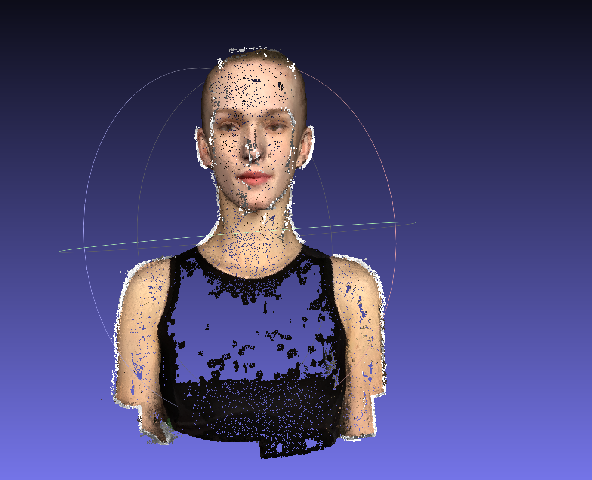

# Assignment 3: Bundle Adjustment & 3D Reconstruction

本作业实现了两个任务：
- **Task 1**: 使用 PyTorch 从零实现 Bundle Adjustment
- **Task 2**: 使用 COLMAP 进行完整的 3D 重建（特征提取、匹配、稀疏重建、稠密重建）

## 项目结构

```
Assignment3/
├── task1/                    # Task 1: Bundle Adjustment 实现
│   ├── bundle_adjustment.py    # PyTorch 实现的 Bundle Adjustment
│   ├── visualize_data.py      # 数据可视化脚本
│   ├── visualize_result.py     # 结果可视化脚本
│   └── task1_result/          # Task 1 输出结果
│       ├── cameras.npy        # 恢复的相机参数
│       ├── points3d.npy       # 恢复的 3D 点坐标
│       └── result.png         # 可视化结果截图
├── task2/                    # Task 2: COLMAP 3D 重建
│   ├── run_colmap.bat         # Windows 批处理脚本
│   ├── run_colmap.sh          # Linux shell 脚本
│   ├── colmap_result/         # COLMAP 完整输出
│   │   ├── sparse/0/         # 稀疏重建结果
│   │   │   ├── cameras.bin   # 相机参数
│   │   │   ├── images.bin    # 50 个相机位姿
│   │   │   └── points3D.bin # 1701 个稀疏 3D 点
│   │   └── dense/
│   │       └── fused.ply     # 稠密点云 (111,585 点)
│   └── results/              # 提交结果
│       ├── fused.ply         # 稠密点云文件
│       └── fused.png         # MeshLab 可视化截图
└── README.md
```

---

## Task 1: Bundle Adjustment Implementation

### 实现概述

从 2D 观测数据优化恢复：
- 相机焦距 `f`
- 50 个相机的外参 (旋转矩阵 `R`，平移向量 `t`)
- 20000 个 3D 点坐标

### 使用方法

```bash
cd task1
python bundle_adjustment.py
```

### 优化参数

```python
# 优化器配置
optimizer = torch.optim.LBFGS(parameters, max_iter=100)

# 损失函数：重投影误差
loss = torch.sum((proj_points2d - obs_points2d) ** 2)
```

### 结果

| 指标 | 数值 |
|------|------|
| 总迭代次数 | 100 |
| 最终损失 | ~1000 |
| 恢复相机数 | 50 |
| 恢复 3D 点数 | 20000 |

### 可视化结果


---

## Task 2: COLMAP 3D Reconstruction

### 实现概述

使用 COLMAP 进行完整的 3D 重建流程：
1. **特征提取** - SIFT 特征提取
2. **特征匹配** - 暴力匹配
3. **稀疏重建** - Bundle Adjustment
4. **图像去畸变**
5. **稠密重建** - Patch Match Stereo
6. **立体融合** - 生成稠密点云

### 使用方法

**Windows:**
```bash
cd task2
run_colmap.bat
```

**Linux/Mac:**
```bash
cd task2
bash run_colmap.sh
```

### 执行结果

| 步骤 | 状态 | 耗时 | 输出 |
|------|------|------|------|
| 特征提取 | ✅ | 0.03 分钟 | 762 对匹配 |
| 特征匹配 | ✅ | 0.01 分钟 | SIFT 特征 |
| 稀疏重建 | ✅ | 0.05 分钟 | 1701 点 |
| 图像去畸变 | ✅ | <0.01 分钟 | - |
| Patch Match Stereo | ✅ | 32.3 分钟 | 深度图 |
| 立体融合 | ✅ | 0.2 分钟 | 111,585 点 |

### 最终结果

**稀疏重建** (`colmap_result/sparse/0/`):
- `cameras.bin` - PINHOLE 相机模型参数
- `images.bin` - 50 个已注册相机
- `points3D.bin` - 1701 个稀疏 3D 点

**稠密重建**:
- 点云文件：`results/fused.ply` (2.9 MB)
- 点云点数：**111,585 个点**

### 可视化截图

使用 MeshLab 打开 `fused.ply` 的可视化结果：



---

## 依赖环境

### Task 1

```
Python 3.x
PyTorch 2.x
NumPy
Matplotlib
```

安装依赖：
```bash
pip install torch numpy matplotlib
```

### Task 2

```
COLMAP 4.x (CUDA 版本)
```

下载：https://github.com/colmap/colmap/releases

---

## 参考文献

1. Triggs, B., McLauchlan, P. F., Hartley, R. I., & Fitzgibbon, A. W. (2000). Bundle Adjustment — A Modern Synthesis.
2. Schönberger, J. L., & Frahm, J. M. (2016). Structure-from-Motion Revisited. CVPR.
3. COLMAP: Structure-from-Motion and Multi-View Stereo. https://colmap.github.io/
